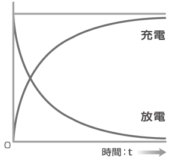
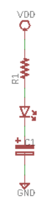
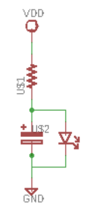
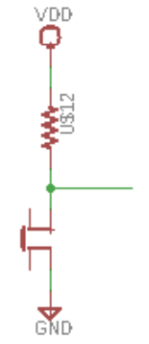
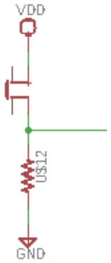
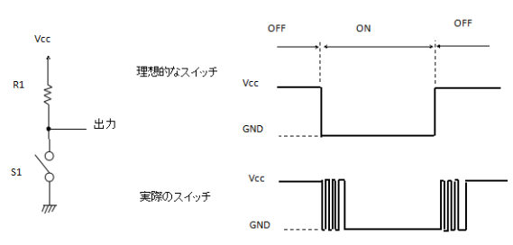
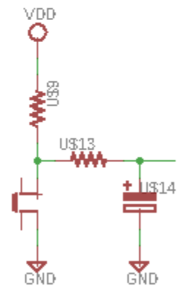

# Lesson3

## 目標  
コンデンサの理解  

### コンデンサ
#### コンデンサの特徴
- 電荷を蓄える(蓄電)
- 電荷を放出する(放電)

###### 蓄電/放電
コンデンサの蓄電は以下の図のように蓄電が行われる   
これらの蓄電にかかる時間などは積分を用いて計算が可能(詳細は載せない[書くのが面倒くさい])    
計算する時は時定数等をもとに計算が可能   

#### コンデンサの種類
- 電解コンデンサ
  - 大容量電源系
- 積層セラミックコンデンサ
  - 高周波特性が良い

#### コンデンサ基本公式
###### コンデンサの容量
- C : 容量
- d : 電極間距離
- s : 電極面積
C = ε(s/d)

###### 電荷量
- Q : 電荷量
- C : 容量
- V : 電圧
Q = CV

#### コンデンサ特性
- 直流の電流を通さない
  - 電荷がたまる為(蓄電)
- 交流の電流は通す
  - 電荷がたまり、放出する為(蓄電/放電を繰り返す)

#### 問題1
- VDD = 5[v]
- R1 = 100[Ω]
- C1 = 0.1[uF]
時間ごとにおけるLEDに流れる電流値[A]を求めよ  

#### 問題2
- VDD = 5[v]
- R1 = 100[Ω]
- C1 = 0.1[uF]
時間ごとにおけるLEDに流れる電流値[A]を求めよ  

### スイッチ
#### スイッチ種類
- トグルスイッチ
- タクトスイッチ等

#### 動作
- 回路の接続切り替えを可能にする

#### プルアップ抵抗/プルダウン抵抗
回路がどこの論理にも接続されていない不定の値をとるのを防ぐ
スイッチを用いた回路を作成するのにショート回路を作成してしまうのを防ぐ

###### プルアップ抵抗
プルアップ抵抗は下図のような回路の時にSWITCHがONになった時に、   
VDDとGNDが接続されてしまい、ショート回路を作ってしまうのを防ぐ   

プルダウン抵抗も下図のような回路の時にSWITCHがONになった時に、   
VDDとGNDが接続されてしまい、ショート回路を作ってしまうのを防ぐ   

#### チャタリング
スイッチを押したときにノイズがされてしまう現象   

###### RC回路
生成されてしまうチャタリングを除去する回路   
この回路をRC回路(ローパスフィルタ)という。   
この回路により高周波数な波形を取り除くことにより、    
チャタリングを除去することが可能である。　　　

