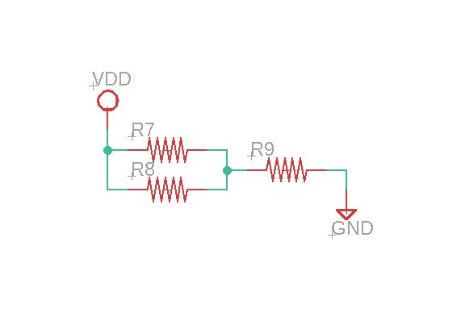

# Lesson3

## 目標  
コンデンサの理解  

### コンデンサ
#### コンデンサの特徴
- 電荷を蓄える(蓄電)
-
-
-

### 直列回路  
回路部品を直列に接続した回路  
R = R1 + R2 + R3  
I1 = I2 = I3  
V = V1 + V2 + V3  

### 並列回路
回路部品を並列に接続した回路  
1/R = 1/(R4 + R6) + 1/R5     
I4 = I6 = I - I5   
V = V4 + V6 = V5  

### 問題1
VDD=5[v]  
1. R7とR8の合成抵抗値?
1. R7とR8とR9の合成抵抗値?
1. R7の電流値
1. R8の電流値
1. R9の電流値

### 消費電力
その回路部品が消費する電力量  
消費電力 E[w] = V * A  

### 問題2
1. 問題7の消費電力[w]

### ダイオード　　
ダイオードの特性　　
- 順方向バイアス
  - Anode => Kathodeの方向へ電流を流す
  - 流れ始める電圧を順方向電圧
  - 電圧降下はほぼ0(抵抗値0)
- 逆方向バイアス
  - Kathode => Anodeへの電流が流れるのを抑える
  - 逆方向に与える電圧が一定値を超えると壊れる(降伏電圧)
  - この特性を使用した回路部品をツェナーダイオード　　

  
Reference:https://hegtel.com/diode-clipper-circuit.html  

### LED  
ダイオードの一種の仲間
- 順電圧
  - Anode => Kathodeの方向へ電流を流す
  - 電圧降下が生じる(順電圧)
    - 消費エネルギーが生じ、その分のエネルギーが光エネルギーに変換
- 逆電
  - Kathode => Anodeの方向へ電流が流れるのを抑える
  - 逆方向に与える電圧が一定値を超えると壊れる(逆電圧)

### 問題3
VDD=5[v]  
LEDの順電圧1.5[V]  
1. R10の電圧降下量  
1. LEDの順電流  

  

### 可変抵抗
抵抗と同じ働きをするが、つまみ部分を回転させることで抵抗値を変更することが可能
  

### トランジスタ
###### ピン名  
- B : ベース
- C : コレクト
- E : エミッタ  

###### 2種類存在
- NPNトランジスタ
  - Bから流れ出る電流を増幅させる(E接地)
- PNPトランジスタ
  - Bへ流れ出る電流を増幅される(C接地)

###### トランジスタ特性  
- 電流を増幅させる
  - B端子へ入力された電流値が電流増幅率分、増幅した電流がC => Eへ流れる
    - 例外
        Ib = 100mA   
        電流増幅率h = 100   
        Ice = 10Aとはならないこともある(トランジスタの種別依存)   
      理由：
        トランジスタが飽和状態である可能性がある(電源電圧が一定の為)
- 回路のスイッチをON/OFF  
  - トランジスタが飽和状態の時、一定以上の電流Ibを入力すると、Icが流れる
    - つまりCE間でのスイッチがONになり回路が動作する

##### 飽和状態
飽和状態とはそれ以上流すことができない最大電流値を回路に供給している状態  
例  
  この例題ではVce, Vbe間の電圧を考慮しないで考える(空想上)  
  下図の状態の場合Ib = 5[v] / 1k[Ω] = 5[mA]    
  増幅率h = 100の場合    
  Ic = 5[mA] * 100 = 500[mA]が理論上流れるはず、  
  だが実際はオームの法則より  
  Ic = 5[v] / 100[Ω] = 50[mA]  
  であるため、Icには50[mA]しか流れない。  
  この状態を飽和状態という。  
  この状態になった時、Ibには0.5[mA]以上を流せば、CE間に電流が流れる(スイッチがONになる)。  

##### その他
- ノイズリーク電流の為Vbe間電圧と同電圧のところに抵抗を挟む  
- Vce間の電圧降下量
- Vbe間の電圧降下量
等を調べる必要がある。  

