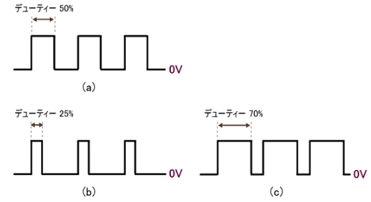

# Lesson4

## 目標
PWM波の理解

### PWM波
#### PWM波の特徴
- 0か1かの波形   
- デューティー比を変更することでPWM波の特性を変更できる   

###### デューティー比
０と１の割合

###### 主な使用場所
- 0と1の信号を使用する(周波数的特性)
  - モーター制御
  - 音の制御
- デューティー比より0と1の割合によりアナログ特徴として使用する
  - DCモーター制御
- 特別な周波数や、デューティー比を生成
  - サーボモーターの制御

###### デューティー比より0と1の割合によりアナログ特徴として使用する
これはデジタル出力データをアナログ的な信号として用いるときに使用する   
例えば下の図ではデューティー比1:4の信号について   
1が周期の80％を占めていて, 0が周期の20%を占めている波形である  
このときの1が5Vの時、出力電圧は擬似的に5[v] * 0.8 = 4.0[v]となる  
